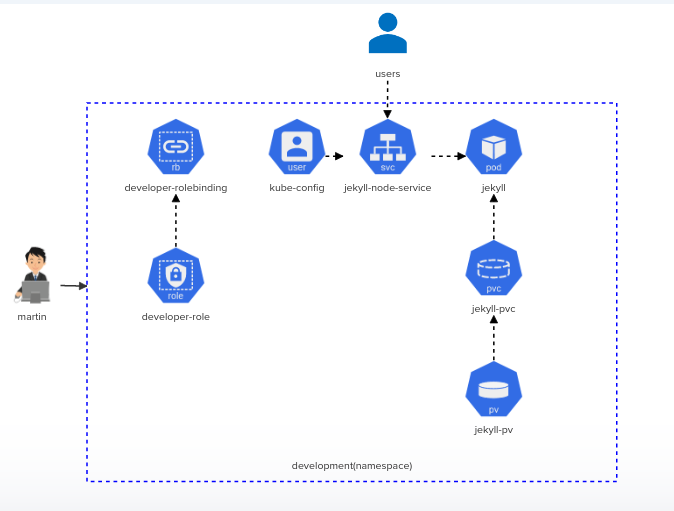
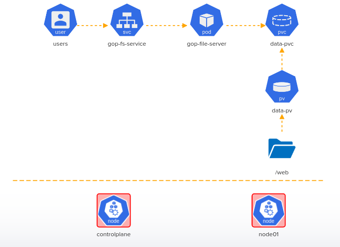
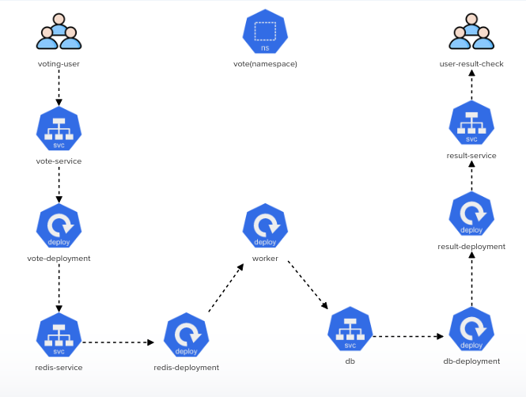
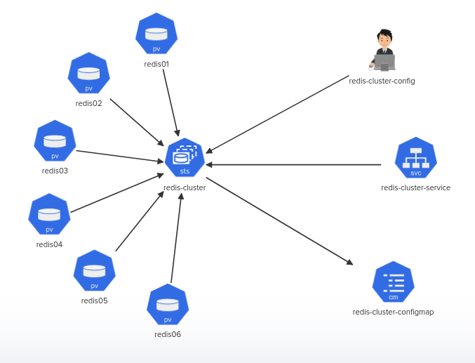

    

# Kodekloud Kubernetes Challenges

This repository contains my solutions for the [Kodekloud Kubernetes challenges](https://kodekloud.com/courses/kubernetes-challenges/). Each challenge requires you to apply your knowledge of Kubernetes to solve a problem or implement a specific architecture.

## Challenges

The repository contains the following challenges:

1. Challenge 1: [Deploy Jekyll SSG](https://kodekloud.com/topic/lab-kubernetes-challenge-1/)
    - **Description**: Deploy the given architecture diagram for implementing a `Jekyll SSG`.
    - **Solution**: [challenge-1](./challenge-1)
    - **Architecture**: 
        

2. Challenge 2: [Troubleshooting and Deploying Objects](https://kodekloud.com/topic/lab-kubernetes-challenge-2/)
    - **Description**: troubleshooting and fixing a broken 2-Node Kubernetes cluster and deploying objects based on the given architecture diagram.
    - **Solution**: [challenge-2](./challenge-2)
    - **Architecture**:
        

3. Challenge 3: [Voting App](https://kodekloud.com/topic/lab-kubernetes-challenge-3/)
    - **Description**: Deploying the Voting App on a Kubernetes cluster.
    - **Solution**: [challenge-3](./challenge-3)
    - **Architecture**: 
        
        
4. Challenge 4: [Redis Cluster](https://kodekloud.com/topic/lab-kubernetes-challenge-4/)
    - **Description**: Build a highly available Redis cluster.
    - **Solution**: [challenge-4](./challenge-4)
    - **Architecture**:
        