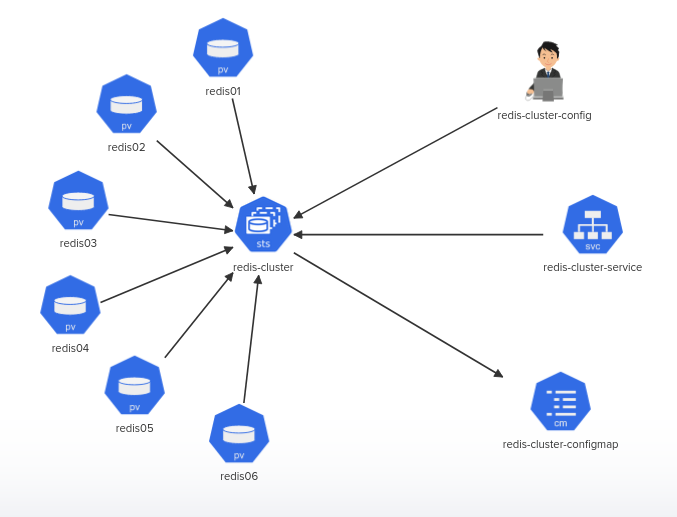

# Challenge 4 - Building a Highly Available Redis Cluster

This solution aims to build a highly available Redis cluster based on the given architecture diagram using Kubernetes.

## Architecture Diagram

The architecture diagram for this challenge can be found in the `challenge4-arch.png` file.



## Solution

The solution is structured as follows:

- `manifests/PVs.yml`: A YAML file that defines the Kubernetes Persistent Volumes.
- `manifests/redis-cluster-statefulset.yml`: A YAML file that defines the Redis cluster stateful set.
- `manifests/redis-cluster-service.yml`: A YAML file that defines the Redis cluster service.


## Deployment Steps

1. Open a terminal and navigate to the manifests directory.
2. Apply the Persistent Volumes configuration:

    ```bash
    kubectl apply -f PVs.yml
    ```
3. Deploy the Redis Cluster service:

    ```bash
    kubectl apply -f redis-cluster-service.yml
    ```
4. Deploy the Redis Cluster stateful set:

    ```bash
    kubectl apply -f redis-cluster-statefulset.yml
    ```
5. Initialize the Redis Cluster by running the following command:

    ```bash
    kubectl exec -it redis-cluster-0 -- redis-cli --cluster create --cluster-replicas 1 $(kubectl get pods -l app=redis-cluster -o jsonpath='{range.items[*]}{.status.podIP}:6379 {end}')a
    ```


## Automate the Deploying

To deploy the Redis Cluster, you can use the provided `deploy-redis-cluster.sh` script. The script automates the deployment process by applying all the YAML files in the `manifests` directory. 

To run the script, navigate to the root directory of the project and execute the following command:

```bash
./deploy-vote-app.sh
```